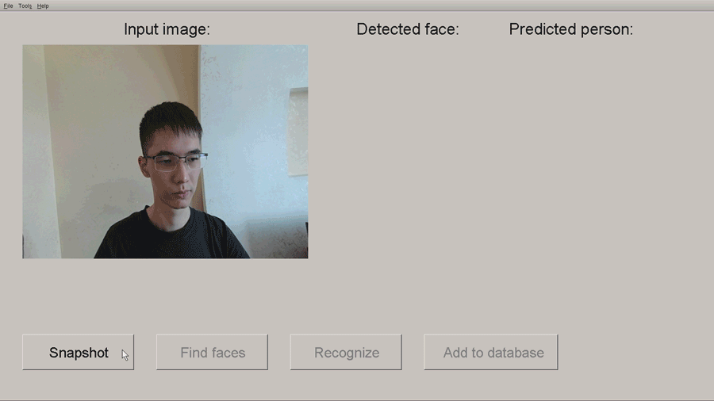

# Face recognition system with GUI
This project implements a face recognition system with a graphical user interface written in C++ with MXNet, Dlib and OpenCV. MTCNN is used as a face detector. Feature extraction for face recognition is performed by the MobileFaceNet CNN. The detection and recognition parts use the MXNet framework. The GUI is written using the Dlib library. Facial pose estimation is performed using the OpenCV library.

The face recognition algorithm will be described in our paper. In short, the algorithm is based on the estimation of the face rotation angle. Using this angle, a face image with the same rotation angle is retrieved from the face database. Comparing face images with close rotation angles can reduce the effect of face pose on recognition accuracy.

  

## Requirements
* Windows
* Visual Studio 2017+
* MXNet 1.3.0/1.4.0
* Dlib with libpng, libjpeg support
* OpenCV 4

## Installation
1. Create a new empty C++ project in Visual Studio and add all files from the «source» folder to the project. 
2. Change solution configuration to Release x64.
3. Add OpenCV, Dlib and MXNet include files.
4. Add compiled OpenCV, Dlib and MXNet lib to dependency lib. 
5. Turn off the 4996 warning for the project in Visual Studio.
6. Build the project.
7. Move face_database, models, arial_32.bdf, arial_36.bdf to the build folder (where .exe file has been created).

## Usage
1. Connect a camera to the computer.
2. Run the face recognition system.
3. Initially the face database is empty so you should add an entry in the face database. Click on «Snapshot» button or open an image using the menu bar.
4. Click on «Find faces» button to run the face detector on the image.
5. If a face is found, click on «Add to database» button.
6. In the window that appears, type the person's name and click on «Add» button.
7. Now the face recognition system can recognize the added person on input images. Try to do this by clicking «Recognize» button.

## References
1. [MXNet MTCNN and MobileFaceNet CNN implementations and models]( https://github.com/njvisionpower/mxnet-insightface-cpp)
2. [Implementation of the face pose estimation algorithm](https://www.learnopencv.com/head-pose-estimation-using-opencv-and-dlib)
3. [Dlib library](http://dlib.net)
4. [OpenCV library](https://opencv.org)
5. [MXNet framework](https://mxnet.apache.org)
